# PrepTalk Architecture Diagram

## Before & After Architecture Comparison

### Before: Monolithic Architecture

```mermaid
graph TB
    subgraph "Before: Monolithic Structure"
        HTML[prototype-c.html<br/>Hardcoded Content]
        CSS[prototype-c.css<br/>2,529 lines]
        JS[ui.js<br/>1,552 lines]
        Voice[voice.js<br/>Fixed 24kHz]

        HTML --> CSS
        HTML --> JS
        HTML --> Voice

        CSS -.->|"All styles mixed"| CSS
        JS -.->|"All logic mixed"| JS
        Voice -.->|"No adaptation"| Voice
    end

    Issues["Issues:<br/>❌ Hard to navigate<br/>❌ All config hardcoded<br/>❌ No audio adaptation<br/>❌ Duplication risk"]

    style CSS fill:#ffcccc
    style JS fill:#ffcccc
    style Voice fill:#ffcccc
    style Issues fill:#ffeeee
```

### After: Modular & Config-Driven Architecture

## Config Loading Sequence

```mermaid
sequenceDiagram
    participant Browser
    participant HTML as prototype-c.html
    participant Loader as config-loader.js
    participant Configs as Config Files
    participant Scout as preflight-audio.js
    participant App as Core App (core/stories/practice)

    Browser->>HTML: Load page
    HTML->>Loader: Execute (blocking)

    activate Loader
    Loader->>Configs: Fetch all 8 configs (parallel)
    Configs-->>Loader: Return JSON data
    Loader->>Loader: Populate window.APP_CONFIG
    Loader->>Browser: Log: "✓ Config loaded"
    deactivate Loader

    HTML->>Scout: Execute preflight
    activate Scout
    Scout->>Scout: Measure network (bandwidth, latency)
    Scout->>Scout: Measure device (CPU, memory, battery)
    Scout->>Scout: Calculate optimal audio profile
    Scout->>Browser: Set window.PREPTALK_AUDIO_CONFIG
    Scout->>Browser: Log: "✓ Audio Scout Complete"
    deactivate Scout

    HTML->>App: Load application JS
    App->>Loader: Read window.APP_CONFIG
    App->>Scout: Read window.PREPTALK_AUDIO_CONFIG
    App->>Browser: Initialize UI with config
    Browser->>Browser: App ready 🎉
```

## Adaptive Audio Decision Flow

## Configuration Externalization Flow

## File Size Optimization

---

## Key Takeaways

1. **Modular Architecture**: Every file has a clear, single responsibility
2. **Config-Driven**: Content and rules separate from code logic
3. **Adaptive Performance**: Quality adjusts to real-world conditions
4. **Maintainable**: All files under 800 lines, easy to navigate
5. **Production-Ready**: Professional patterns worthy of serious evaluation

**Result**: A codebase that's faster to iterate, easier to maintain, and performs better under varying conditions.
