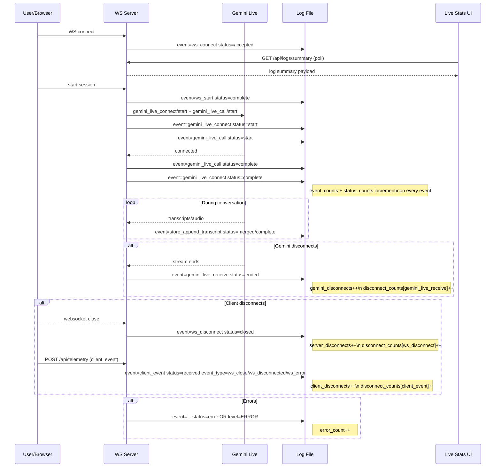

# Live Stats Lifecycle

This sequence diagram shows when each Live Stats metric is produced in the
interview lifecycle and which log events drive the counters.

Metric mapping reference (see `app/services/log_metrics.py`):
- `client_disconnects`: `event=client_event` with `event_type` in `ws_close`, `ws_disconnected`, `ws_error`
- `server_disconnects`: `event=ws_disconnect`
- `gemini_disconnects`: `event=gemini_live_receive status=ended`
- `error_count`: any log with `status=error` or log level `ERROR`/`CRITICAL`
