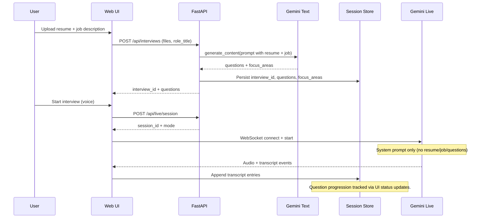

# Gemini Live Interview Practice Design

## Context
- New repo in `./` (this repo) for the Gemini 3 Hackathon.
- Gemini 3 Live full-duplex voice is the primary interface via AI Studio; no text input.
- Multi-model Gemini 3 usage: questions, live coaching, summaries.
- Demo likely delivered via an AI Studio app.

## Goals
- Voice-first interview practice with streaming audio in and out.
- Session persistence for transcripts, scoring, and PDF study guides.
- Simple FastAPI backend and vanilla JS frontend for rapid iteration.
- Responsive layout that works on mobile and desktop.

## Non-Goals
- Text-only fallback.
- Third-party voice services.
- Production-scale auth, billing, or team management.

## Decisions
- Audio streaming format: PCM16 mono at 24 kHz in ~20 ms frames for natural conversation.
- Text generation uses `gemini-3-pro-preview` for question generation and scoring; live audio uses `gemini-2.5-flash-native-audio-preview-12-2025` for streaming.
- Study guide includes rubric, transcript, and summary.
- Session persistence is per user, stored under app/session_store/<user_id>.
- Live session resumption uses local transcript memory (full transcript) injected into the Gemini Live system prompt on reconnect.
- Logs are user-facing; keep IDs short and readable (5-char alphanumeric hash).
- Coach help mode: if the candidate asks for help, provide a concise draft answer, then prompt them to answer in their own words (STAR for behavioral; 60-90 seconds for situational) and offer frameworks.

## Architecture Overview
The backend runs a FastAPI service that handles uploads, session state, and Gemini 3 calls. A WebSocket endpoint bridges the browser microphone stream to Gemini Live and streams audio responses back to the client. A separate Gemini text client handles agenda generation and post-session summaries. Session data is stored as per-user JSON on disk (app/session_store/<user_id>) and used to generate a PDF study guide with rubric, transcript, and summary.

Mermaid reference diagram: `docs/plans/2026-01-12-live-context-mermaid.md`.

## Context & Question Tracking (Current Flow)
The resume and job description are only used to generate the initial questions/rubric. The live Gemini coach session is started without those artifacts, so it lacks role context and does not follow the question list or track what has been asked.



### UAT Observations (Gap Symptoms)
- Coach asks for the target role despite job description already supplied.
- Coach improvises instead of following the question list.
- Coach repeats “what role are you interviewing for.”

## Components
### Backend
- FastAPI routes for session creation, upload, summary retrieval, and PDF export.
- WebSocket route for Gemini Live audio streaming.
- Audio format for live streaming: PCM16 mono @ 24 kHz (~20 ms frames).
- Gemini Live client to create sessions, forward audio frames, and receive audio or transcript events.
- Gemini text client for question agenda and summary generation.
- Session store for per-user JSON persistence under app/session_store/<user_id>.
- PDF renderer using WeasyPrint or a similar library (includes rubric + transcript + summary).
- Test-only Gemini Live adapter to simulate streaming events for E2E tests.
- Resume/JD ingestion supports PDF, DOCX, and TXT.

### Frontend
- Export transcript (TXT) from the live session transcript.
- Mute toggle for live voice input (pause mic frames).
- Restart interview flow (reset transcript/score, keep question set).
- Session naming UI (rename current interview).
- Add custom questions to the interview agenda.
- Question status tracking (non-started/started/answered) with manual toggles and auto-start on coach prompts.
- app/templates/index.html: voice-first UI with start and stop controls.
- app/static/js/voice.js: mic capture, audio buffering, and playback.
- app/static/js/transport.js: WebSocket lifecycle, reconnect, and status.
- app/static/js/ui.js: transcript rendering and session status.
- Responsive layout with stacked panels on mobile and split panes on desktop.


## UI Feature Design (Session Tools Drawer)
The Session Tools drawer slides in from the left and centralizes non-live actions while keeping the live controls uncluttered. Mute remains next to Start/Stop for immediate access during the conversation. The drawer is state-aware but always openable; actions are disabled with short helper text when unavailable.

```text
┌─────────────────────────────────────────────────────────────────────────────┐
│ Session Controls                                                            │
│ [Start Interview] [Stop Session] [Mute/Unmute]   Status: Connected          │
│                                                                             │
│ [≡ Session Tools] (opens left drawer)                                       │
├─────────────────────────────────────────────────────────────────────────────┤
│ Main Content (Questions | Transcript | Score)                               │
└─────────────────────────────────────────────────────────────────────────────┘

Left Drawer (Session Tools)
┌───────────────────────────────┐
│ Session Tools          [×]     │
│ ───────────────────────────── │
│ Session name                  │
│ [___________rename__________] │
│ [Save name]                   │
│                               │
│ Add known questions           │
│ [textarea …]                  │
│ [Add & jump] [Add only]       │
│                               │
│ Export transcript             │
│ [Export TXT]  (disabled until │
│  transcript exists)           │
│                               │
│ Restart interview             │
│ [Restart] (disabled until     │
│  session started)             │
└───────────────────────────────┘
```

```html
<section class="ui-controls">
  <button id="start-interview">Start Interview</button>
  <button id="stop-interview">Stop Session</button>
  <button id="mute-interview">Mute</button>
  <button id="open-session-tools" aria-controls="session-tools-drawer">
    ☰ Session Tools
  </button>
</section>

<aside id="session-tools-drawer" class="drawer drawer--left" aria-hidden="true">
  <header class="drawer__header">
    <h3>Session Tools</h3>
    <button id="close-session-tools" aria-label="Close">×</button>
  </header>

  <section class="drawer__section">
    <label>Session name</label>
    <input id="session-name-input" />
    <button id="save-session-name">Save name</button>
  </section>

  <section class="drawer__section">
    <label>Add known questions</label>
    <textarea id="custom-questions-input"></textarea>
    <div class="row">
      <button id="add-question-jump">Add &amp; jump</button>
      <button id="add-question">Add only</button>
    </div>
  </section>

  <section class="drawer__section">
    <label>Export transcript</label>
    <button id="export-transcript" disabled>Export TXT</button>
    <small>Enabled after transcript exists.</small>
  </section>

  <section class="drawer__section">
    <label>Restart interview</label>
    <button id="restart-interview" disabled>Restart</button>
    <small>Enabled after session starts.</small>
  </section>
</aside>
```

Task tracking
- [ ] TDD gate: write a failing test for each new UI action before coding.
- [ ] Verify each test fails for the expected reason (RED).
- [ ] Implement minimal UI logic to pass each test (GREEN).
- [ ] Refactor only after green; keep tests passing.
- [ ] Add the Session Tools launcher near Session Controls and a left slide-in drawer shell.
- [ ] Wire session naming (save and display) with the current interview id.
- [ ] Add custom question input with add-and-jump and add-only flows.
- [ ] Add transcript export (TXT) from the stored session transcript.
- [ ] Add restart interview flow (reset transcript/score, keep questions by default).
- [ ] Make drawer actions state-aware with inline helper text for disabled states.

## Data Flow
1. User uploads resume and job description (PDF, DOCX, or TXT).
2. Backend uses Gemini question model to create an agenda and evaluation rubric.
3. User starts the live interview; browser streams mic audio to the backend.
4. Backend forwards audio to Gemini Live; receives audio and transcript events.
5. Client plays coach audio and renders rolling transcripts.
6. On stop, backend runs Gemini summary model and generates a PDF study guide with rubric and transcript.
7. User can export a full transcript and manage session settings (mute, restart, name, custom questions).

## Error Handling and Resilience
- Mic permission denied: block the session and display clear re-enable steps.
- WebSocket disconnect: offer retry and preserve session state on disk.
- Gemini Live errors: log details, show user-friendly messages, and backoff.
- Rate limits or quota: notify the user and keep the transcript for later resume.
- Keepalive pings on the live WebSocket; reconnect reuses the same interview session.

## Live Voice Streaming Fallback (Current)
- Transport-level reconnect: the WebSocket client retries if the connection drops.
- Gemini session reconnect: on `gemini-disconnected`, the UI retries `start` up to 3 times.
- On reconnect, the server rebuilds the system prompt using the locally stored transcript memory to preserve context.
- No model fallback: if Gemini Live returns a policy error (e.g., 1008), the session ends and the user must restart. Set `GEMINI_LIVE_MODEL` to a supported model to stabilize Live sessions.

## Logging & Observability
- Log per request with short, user-friendly fields; use interview_id hash only (5-char alphanumeric).
- Record requested_model and effective_model on every Gemini text/live call, including fallbacks.
- Emit structured event types (e.g., interview_create, gemini_live_connect, gemini_text_call).
- Avoid logging sensitive content; prefer sizes and counts over raw text.

## Data Privacy and Retention
- Transcripts and uploads are stored per user in app/session_store/<user_id>.
- Logs are intended for end users; exclude raw resume/JD text and redact sensitive fields.

## Testing Plan
- Unit tests for session storage and transcript assembly.
- Mocked Gemini Live streaming tests to validate message flow.
- API tests for session lifecycle endpoints.
- Manual voice smoke tests for mic permissions and playback latency.
- Manual test: live memory resumption (main branch).
  - Checkout `main`.
  - Set `INTERVIEW_ADAPTER=gemini` and `GEMINI_API_KEY` in `.env`.
  - Run `./run.sh ui`, start a live session, and speak 2-3 turns.
  - Force a drop (disable network or stop the server), then allow the UI to reconnect.
  - Confirm the coach continues the conversation without repeating earlier context.
  - Inspect `app/session_store/<user_id>/<interview_id>.json` and verify `live_memory` contains the transcript so far.
- Playwright artifacts (screenshots/video) are enabled; use separate runs to capture mock vs live.
  - Mock: `PLAYWRIGHT_HTML_REPORT=playwright-report-mock npx playwright test --reporter=html --output test-results-mock`
  - Live: `set -a; source .env; set +a; E2E_LIVE=1 PLAYWRIGHT_HTML_REPORT=playwright-report-live npx playwright test --reporter=html --output test-results-live`

## Integration Test Plan
- Playwright E2E script that drives the UI like a user: upload resume/JD, start session, stream audio, verify transcript, score, and PDF export.
- Test-only adapter provides deterministic Gemini Live events in mock mode.
- Optional live mode runs against AI Studio with a test persona on request.

## Hackathon Compliance Notes
- New project created during the contest period.
- Gemini 3 is central to questions, live coaching, and summaries.
- English UI and submission materials.
- Provide AI Studio demo link, public repo, 3-minute video, and Gemini integration write-up.


## Implementation Checklist

### Backend
- [x] FastAPI scaffold and base routes (`/`, `/health`).
- [x] Interview API endpoints (mock): create, live session, scoring.
- [x] WebSocket endpoint for full-duplex audio streaming.
- [x] Gemini Live adapter: session creation + audio frame forwarding.
- [x] Gemini text adapter: question generation + scoring.
- [x] Session store persistence on disk (`app/session_store/<user_id>`).
- [x] PDF study guide rendering + export endpoint (rubric + transcript + summary).
- [x] Error handling for mic denial, WS disconnects, and quota limits.
- [x] Model usage logging (requested vs effective) with interview_id hash.

### Frontend
- [x] Export transcript (TXT) from the live session transcript.
- [x] Mute toggle for live voice input (pause mic frames).
- [x] Restart interview flow (reset transcript/score, keep question set).
- [x] Session naming UI (rename current interview).
- [x] Custom question input to append known questions.
- [x] Question status tracking with manual toggles and auto-start on coach prompts.
- [x] Voice-first UI shell (setup, controls, transcript, score).
- [x] Microphone capture + audio playback pipeline (PCM16 @ 24 kHz).
- [x] WebSocket transport layer with reconnect + status.
- [x] Live transcript streaming + incremental updates.
- [x] Responsive layout (split on desktop, stack on mobile).

### Testing
- [x] API tests for session lifecycle (mock adapter).
- [x] Playwright E2E flow (mock adapter).
- [x] Mocked Gemini Live streaming tests for event flow.
- [x] Resolve `google/genai` DeprecationWarning on Python 3.14 (pin/upgrade or warn filter).
- [ ] Manual voice smoke tests (mic permissions + latency).
  - Run steps in `docs/testing/voice-smoke-test.md`.
- [x] Optional live-mode E2E with AI Studio persona (gated by `E2E_LIVE=1`).

### Hackathon Deliverables
- [ ] AI Studio demo link.
- [ ] Gemini integration write-up.
- [ ] 3-minute demo video.
