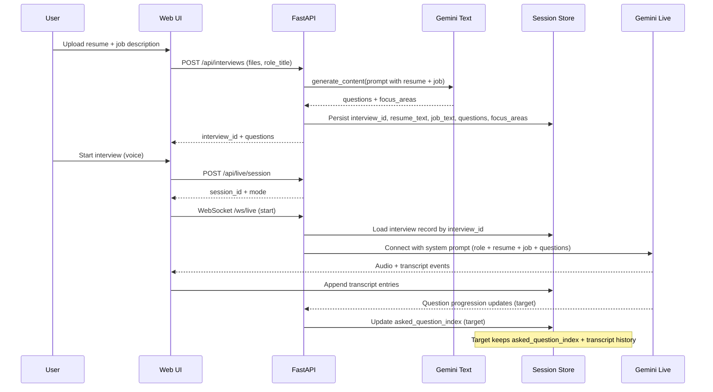

# Live Context Flow (Target Design)

```mermaid
sequenceDiagram
    participant U as User
    participant UI as Web UI
    participant API as FastAPI
    participant TXT as Gemini Text
    participant S as Session Store
    participant LIVE as Gemini Live

    U->>UI: Upload resume + job description
    UI->>API: POST /api/interviews (files, role_title)
    API->>TXT: generate_content(prompt with resume + job)
    TXT-->>API: questions + focus_areas
    API->>S: Persist interview_id, resume_text, job_text, questions, focus_areas
    API-->>UI: interview_id + questions

    U->>UI: Start interview (voice)
    UI->>API: POST /api/live/session
    API-->>UI: session_id + mode
    UI->>API: WebSocket /ws/live (start)
    API->>S: Load interview record by interview_id
    API->>LIVE: Connect with system prompt (role + resume + job + questions)
    LIVE-->>UI: Audio + transcript events
    UI->>S: Append transcript entries
    LIVE-->>API: Question progression updates (target)
    API->>S: Update asked_question_index (target)

    Note over S: Target keeps asked_question_index + transcript history
```
