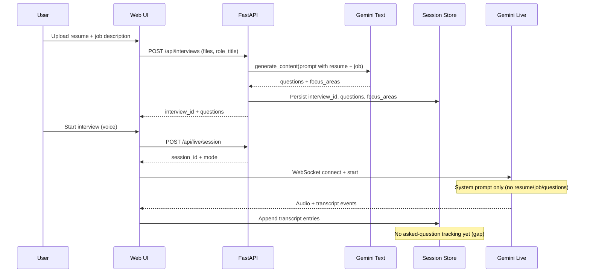

# Live Context Flow (Mermaid)

```mermaid
sequenceDiagram
    participant U as User
    participant UI as Web UI
    participant API as FastAPI
    participant TXT as Gemini Text
    participant S as Session Store
    participant LIVE as Gemini Live

    U->>UI: Upload resume + job description
    UI->>API: POST /api/interviews (files, role_title)
    API->>TXT: generate_content(prompt with resume + job)
    TXT-->>API: questions + focus_areas
    API->>S: Persist interview_id, questions, focus_areas
    API-->>UI: interview_id + questions

    U->>UI: Start interview (voice)
    UI->>API: POST /api/live/session
    API-->>UI: session_id + mode
    UI->>LIVE: WebSocket connect + start
    Note over LIVE: System prompt only (no resume/job/questions)
    LIVE-->>UI: Audio + transcript events
    UI->>S: Append transcript entries

    Note over S: No asked-question tracking yet (gap)
```
