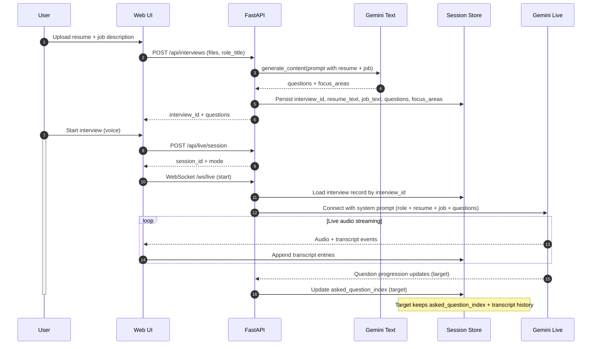

# Live Context Flow (Target Design)

## Numbered Explanation
1. User uploads resume and job description; the UI sends them to the backend.
2. Backend extracts text and calls Gemini Text to generate questions and focus areas.
3. Backend stores the interview record with resume/job excerpts and the question list.
4. User starts a live session; the UI opens the live WebSocket.
5. Backend loads the interview record and builds the Gemini Live system prompt with context.
6. Gemini Live streams audio and transcript events; the UI renders them and appends to the session store.
7. Target behavior: Gemini Live reports question progression, and the backend tracks asked questions.
