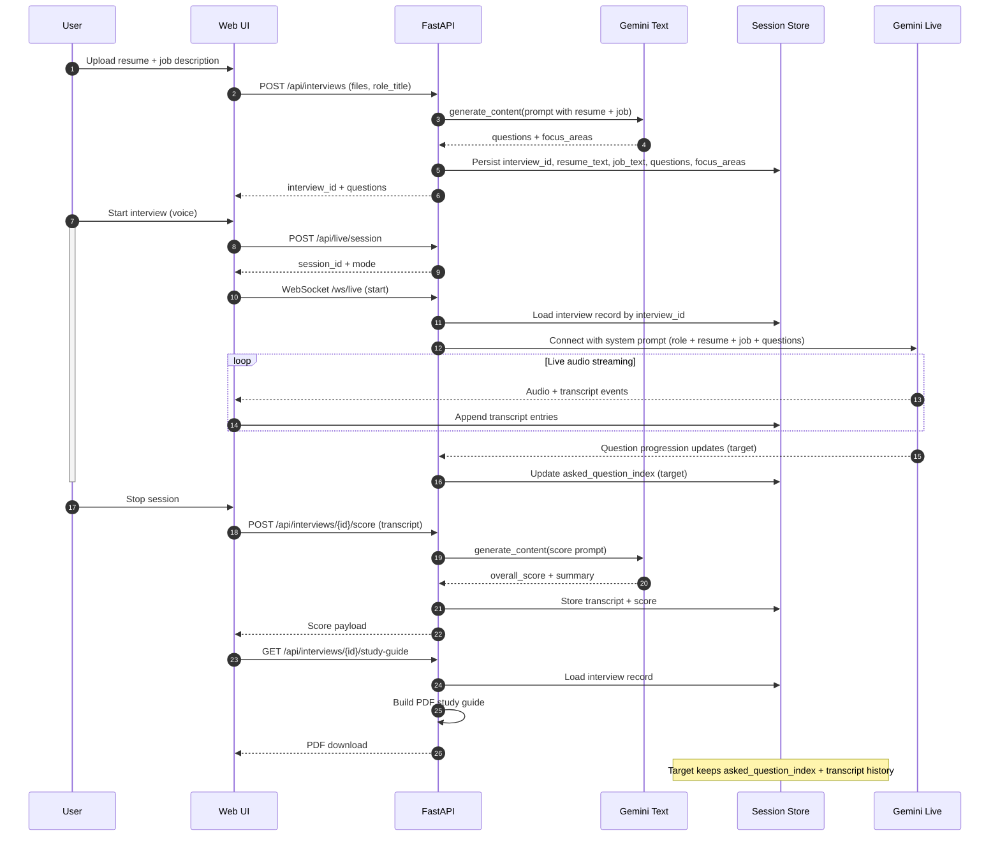

# Live Context Flow (Target Design)

## Numbered Explanation
1. User uploads resume and job description; the UI sends them to the backend.
2. Backend sends the extracted content to Gemini Text for question generation.
3. Gemini Text returns the question list and focus areas.
4. Backend stores the interview record with resume/job excerpts and the question list.
5. Backend returns the interview id and questions to the UI.
6. User starts the interview from the UI.
7. UI requests a live session.
8. Backend returns the live session id and mode.
9. UI opens the live WebSocket and sends the start message.
10. Backend loads the interview record from session storage.
11. Backend connects to Gemini Live with the full system prompt (role + resume + job + questions).
12. Gemini Live emits audio and transcript events during streaming.
13. UI appends each transcript event to the session store.
14. Target behavior: Gemini Live emits question progression updates.
15. Backend updates asked_question_index in the session store.
16. User stops the session from the UI.
17. UI posts the transcript to the scoring endpoint.
18. Backend calls Gemini Text to score the transcript.
19. Gemini Text returns the overall score and summary.
20. Backend stores the transcript and score in the session store.
21. Backend returns the score payload to the UI.
22. User requests the PDF study guide export.
23. Backend loads the interview record from session storage.
24. Backend renders the PDF study guide.
25. Backend returns the PDF to the UI.
26. UI triggers the PDF download.
