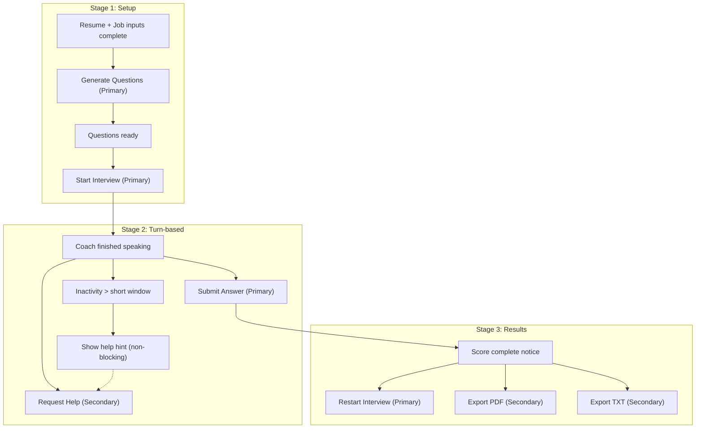

# Feature Spec: 20260203-cta-clarity

Status: Draft
Created: 2026-02-03 10:01
Inputs: CR-20260203-0949
Decisions: D-20260203-1001

## Summary
Define a stage-gated CTA hierarchy across Setup, Live, and Results so each screen has a single primary action and clear, minimal secondary actions that match the user’s stated priorities.

## User Stories & Acceptance

### US1: Stage 1 CTA progression (Priority: P1)
Narrative:
- As a user, I want the setup CTAs to guide me from inputs to question generation to starting the interview, so I always know the next step.

Acceptance scenarios:
1. Given resume + job inputs are complete and questions are not generated, When the setup screen is shown, Then “Generate Questions” is the primary CTA and “Start Interview” is disabled. (Verifies: FR-001, FR-004)
2. Given questions are generated, When the setup screen is shown, Then “Start Interview” is the primary CTA and generation is no longer the primary action. (Verifies: FR-001, FR-004)
3. Given E2E tests are run in mock and live modes, When the CTA UI renders, Then tests assert primary/secondary CTA labels and states for each stage. (Verifies: FR-013)

### US2: Stage 2 CTA focus (Priority: P1)
Narrative:
- As a user in a live interview, I want a single dominant submit action and an easy help action, so I can focus on answering without UI clutter.

Acceptance scenarios:
1. Given the coach finishes speaking and the user has entered any answer text, When Stage 2 is active, Then “Submit Answer” is the primary CTA and “Request Help” is a secondary action. (Verifies: FR-002, FR-004)
2. Given the user is inactive for a short period, When Stage 2 is active, Then a non-blocking hint points to the help action without changing the primary CTA. (Verifies: FR-002, FR-004)

### US3: Stage 3 results emphasis (Priority: P1)
Narrative:
- As a user who finished the interview, I want to restart easily and export my study guide, so I can iterate quickly and keep artifacts.

Acceptance scenarios:
1. Given scoring is complete, When Stage 3 is shown, Then “Restart Interview” is the primary CTA and export actions are secondary. (Verifies: FR-003, FR-004)
2. Given the score is ready, When Stage 3 is shown, Then the UI explicitly indicates that export options are available. (Verifies: FR-003)

## Requirements

Functional requirements:
- FR-001: Stage 1 uses a staged CTA hierarchy: inputs → “Generate Questions” (primary) → “Start Interview” (primary once questions are ready). (Sources: CR-20260203-0949; D-20260203-1001)
- FR-002: Stage 2 uses a single primary CTA (“Submit Answer”) when the coach finishes speaking; “Request Help” is secondary and a brief inactivity hint may surface without displacing the primary CTA. (Sources: CR-20260203-0949; D-20260203-1001)
- FR-003: Stage 3 makes “Restart Interview” the primary CTA and keeps export options (PDF/TXT) as secondary actions with a clear scoring-complete notice. (Sources: CR-20260203-0949; D-20260203-1001)
- FR-004: Exactly one primary CTA is visually dominant per stage, with disabled actions showing a short reason. (Sources: CR-20260203-0949; D-20260203-1001)
- FR-005: Documentation includes a Mermaid flow diagram that describes CTA gating across all three stages. (Sources: CR-20260203-0949)
- FR-006: Documentation includes an ASCII CTA summary per stage (primary + secondary actions). (Sources: CR-20260203-1017)
- FR-007: Documentation includes ASCII wireframes in code blocks for Stages 1–3. (Sources: CR-20260203-1022)
- FR-008: Documentation includes ASCII wireframes for mobile and web views of Stages 1–3, highlighting CTA placement. (Sources: CR-20260203-1024)
- FR-009: Documentation includes web-view wireframe images for Stages 1–3. (Sources: CR-20260203-1030)
- FR-010: Documentation includes mobile-view wireframe images for Stages 1–3. (Sources: CR-20260203-1034)
- FR-011: Wireframe images are embedded inline in the spec for quick review. (Sources: CR-20260203-1038)
- FR-012: Replace the “Advanced Setup” label with “Extras” wherever it appears in the CTA UI. (Sources: CR-20260203-1044)
- FR-013: Playwright E2E tests are updated to validate CTA changes in both mock and live runs. (Sources: CR-20260203-1050)

## Edge cases
- Missing inputs: “Start Interview” remains disabled and the reason is shown. (Verifies: FR-001, FR-004)
- Inactivity during Stage 2: help hint appears without interrupting transcript or submit flow. (Verifies: FR-002)

## CTA Summary (ASCII)
Stage 1 (Setup)
- Primary: Generate Questions → Start Interview (after questions ready)
- Secondary: Continue Session (if resumable)
- Tertiary: Extras (drawer)

Stage 2 (Turn-based)
- Primary: Submit Answer (after coach finishes + answer text exists)
- Secondary: Request Help, End Interview
- Tertiary: Questions (modal), Pin/Unpin, More (rubric)

Stage 3 (Results)
- Primary: Restart Interview
- Secondary: Export PDF, Export TXT
- Tertiary: View Transcript, Extras

## Wireframes (ASCII, Mobile + Web — CTA placement)
Key: (P = Primary, S = Secondary, T = Tertiary)
Stage 1 — Setup / Generate (Mobile)
```txt
+----------------------------+
| PrepTalk                   |
| 2-line intro               |
| [Inputs ready]             |
| [Questions ready]          |
|                            |
| Candidate Setup            |
| [Resume file]              |
| [Job file]                 |
| [Job URL]                  |
| [Generate Questions] (P)   |
|                            |
| Questions (placeholder)    |
| - Q1 ...                   |
| - Q2 ...                   |
|                            |
| Controls                   |
| [Start Interview] (P when) |
| [Continue] (S if resumable)|
| [Extras] (T)               |
+----------------------------+
```

Stage 1 — Setup / Generate (Web)
```txt
+---------------------------------------------------------------+
| PrepTalk                                                      |
| 2-line intro text                                             |
| [Inputs ready] [Questions ready]                              |
|                                                               |
| Candidate Setup                   | Questions (placeholder)   |
| [Resume file] [Job file] [URL]    | - Q1 ...                  |
| [Generate Questions] (Primary)    | - Q2 ...                  |
|                                                               |
| Session Controls                                              |
| [Start Interview] (Primary when ready)                        |
| [Continue] (Secondary if resumable)                           |
| [Extras] (Tertiary)                                           |
+---------------------------------------------------------------+
```

Stage 2 — Live (Turn-based) (Mobile)
```txt
+----------------------------+
| Current Question           |
| [Pinned Insight] (opt)     |
|                            |
| Transcript (primary)       |
| coach: ...                 |
| user: ...                  |
|                            |
| [Submit Answer] (Primary)  |
| [Request Help] (Secondary) |
| [End Interview] (Secondary)|
| [Questions] (T) [More] (T) |
+----------------------------+
```

Stage 2 — Live (Turn-based) (Web)
```txt
+---------------------------------------------------------------+
| Current Question                                              |
| [Pinned Insight Card] (optional, collapsible)                 |
|                                                               |
| Transcript (primary surface)                                  |
| coach: ...                                                    |
| user: ...                                                     |
|                                                               |
| Controls                                                      |
| [Submit Answer] (Primary)                                     |
| [Request Help] (Secondary) [End Interview] (Secondary)        |
| [Questions] (Tertiary modal) [More] (Tertiary modal)           |
+---------------------------------------------------------------+
```

Stage 3 — Results / Export (Mobile)
```txt
+----------------------------+
| Score Summary              |
| [Score ready]              |
|                            |
| [Restart Interview] (P)    |
| [Export PDF] (S)           |
| [Export TXT] (S)           |
|                            |
| [View Transcript] (T)      |
| [Extras] (T)               |
+----------------------------+
```

Stage 3 — Results / Export (Web)
```txt
+---------------------------------------------------------------+
| Score Summary                                                  |
| [Score ready]                                                  |
|                                                               |
| [Restart Interview] (Primary)                                 |
| [Export PDF] (Secondary) [Export TXT] (Secondary)             |
|                                                               |
| Transcript (collapsed) [View Transcript] (Tertiary)           |
| Extras (Tertiary)                                             |
+---------------------------------------------------------------+
```

## Wireframes (SVG, Inline)
Stage 1 — Setup / Generate
Web

Mobile


Stage 2 — Live (Turn-based)
Web

Mobile


Stage 3 — Results / Export
Web

Mobile


Wireframe file paths (for direct access):
- `docs/specs/20260203-cta-clarity/assets/web-stage1.svg`
- `docs/specs/20260203-cta-clarity/assets/web-stage2.svg`
- `docs/specs/20260203-cta-clarity/assets/web-stage3.svg`
- `docs/specs/20260203-cta-clarity/assets/mobile-stage1.svg`
- `docs/specs/20260203-cta-clarity/assets/mobile-stage2.svg`
- `docs/specs/20260203-cta-clarity/assets/mobile-stage3.svg`

## Flow Diagram (Mermaid)

