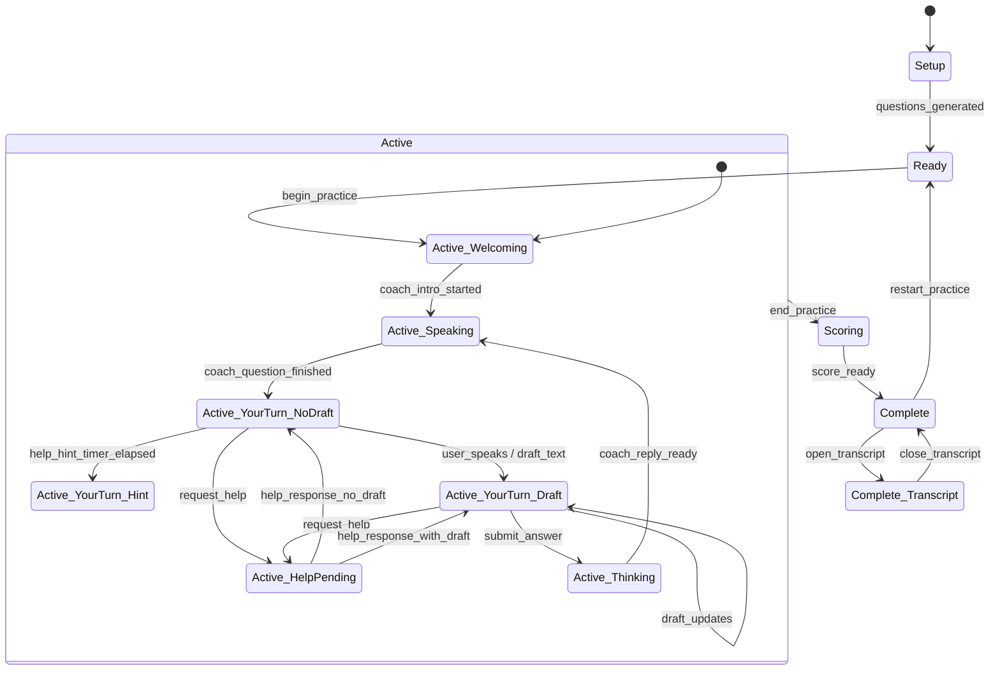
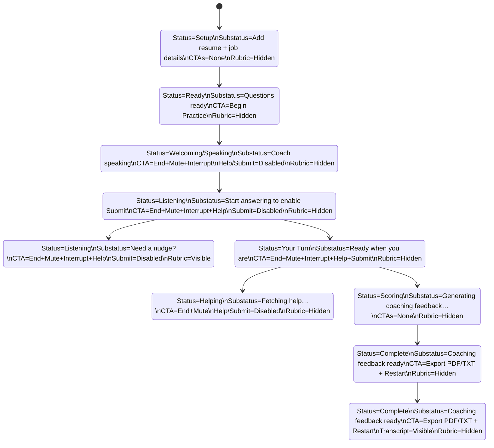

# Feature Spec: 20260205-session-layout-target

Status: Draft
Created: 2026-02-05 10:20
Inputs: CR-20260205-1020, CR-20260205-1033, CR-20260205-1049, CR-20260205-2138
Decisions: D-20260205-1020, D-20260205-2138

## Summary
Define the target session layout and state logic for the PrepTalk UI, including ASCII state frames, Mermaid state diagrams, and explicit status/substatus/rubric rules. This spec aligns on a panel-only layout update with overflow menu behavior, keeps Extras unchanged, and avoids any special anchored positioning for the status/CTA panel. (Sources: CR-20260205-1020, CR-20260205-1033, CR-20260205-1049; D-20260205-1020)


## Non-changes / Out of scope
- Only panel layout and menu overflow behavior are in scope for this update (desktop + mobile).
- The Extras panel behavior and contents do not change. (Sources: CR-20260205-1049)
- No sticky/anchored positioning is required for the status/CTA panel. (Sources: CR-20260205-1033)
- No backend/API changes.
- No data model/schema changes.
- No theme/branding changes (theme remains as-is).
- No new routes or navigation patterns.

## User Stories & Acceptance

### US1: Align on target session layout and state logic (Priority: P1)
Narrative:
- As a product owner, I want a precise state-by-state layout and UI state flow, so that we can implement changes without ambiguity.

Acceptance scenarios:
1. Given the spec, when I review the states, then each state/sub-state includes a full ASCII layout with menu placement and CTA/status rules. (Verifies: FR-001, FR-002, FR-006)
2. Given the spec, when I review the diagrams, then I can see a logic flow diagram and a UI output-state diagram. (Verifies: FR-005)
3. Given the spec, when I review status behavior, then each status includes a substatus and rubric visibility rule. (Verifies: FR-003)

## Requirements

Functional requirements:
- FR-001: Document the target layout for each state/sub-state with ASCII frames, including header, top status/CTA panel, transcript, questions, insights, and score panels as applicable. (Sources: CR-20260205-1020; D-20260205-1020)
- FR-002: Specify menu placement and visibility as a responsive overflow: the menu appears only when active components are pushed below the fold, and lists only active off-screen items. (Sources: CR-20260205-1020, CR-20260205-1049; D-20260205-1020)
- FR-003: Define status, substatus, and rubric display rules for each active interview sub-state, including help callout behavior. (Sources: CR-20260205-1020; D-20260205-1020)
- FR-004: Define completion states (E/F) with export CTAs (PDF/TXT), Candidate Setup re-entry, and transcript visibility rules. (Sources: CR-20260205-1020)
- FR-005: Provide Mermaid state diagrams for logic flow and UI output states. (Sources: CR-20260205-1020)
- FR-006: Include interrupt button behavior in active states with enabled/disabled rules. (Sources: CR-20260205-1020, CR-20260205-2138; D-20260205-2138)
- FR-007: Use standard responsive breakpoints for layout intent: mobile <=640px, tablet 641–1024px, desktop >=1025px. (Sources: CR-20260205-1020, CR-20260205-1049; D-20260205-1020)

Non-functional requirements:
- NFR-001: Keep the spec actionable and implementation-ready with explicit state naming, CTA labels, and menu contents per state. (Sources: CR-20260205-1020)

## Status / Substatus / Rubric Map (Active Interview)

| UI State | Status | Substatus | Help Callout | Rubric |
| --- | --- | --- | --- | --- |
| Coach speaking | Welcoming / Speaking | Coach is speaking. Wait to request help or submit your answer. | Visible | Hidden |
| Your turn, no draft | Listening | Start answering to enable Submit. Help is available as soon as the coach finishes speaking. | Visible | Hidden until hint triggers |
| Your turn, hint triggered | Listening | Need a nudge? Use Request Help for a rubric-based tip. | Visible | Visible |
| Your turn, draft present | Your Turn | Ready when you are. Request help or submit your answer. | Visible | Hidden |
| Help pending | Helping | Fetching help... | Visible | Hidden |

## Mermaid Diagram: Logic Flow



## Mermaid Diagram: UI Output States



## ASCII State Frames

State A — Setup (full screen)
```text
Menu: hidden

┌─────────────────────────────────────────────────────────────────────────────┐
│ Header: PrepTalk                                                             │
└─────────────────────────────────────────────────────────────────────────────┘

┌─────────────────────────────────────────────────────────────────────────────┐
│ Top Status/CTA Panel                                                         │
│ [ Status: Setup ]                                                            │
│ Add resume + job details to generate questions.                              │
│ (no action buttons shown)                                                    │
└─────────────────────────────────────────────────────────────────────────────┘

┌─────────────────────────────────────────────────────────────────────────────┐
│ Candidate Setup (full screen)                                                │
│ Resume upload                                                                │
│ Job description upload / URL                                                 │
│ [ Generate Questions ]                                                       │
└─────────────────────────────────────────────────────────────────────────────┘
```

State B — Ready (idle, setup hidden)
```text
Menu (≡):
- Guide (expand)
- Candidate Setup

┌─────────────────────────────────────────────────────────────────────────────┐
│ Header: PrepTalk                                                      [ ≡ ] │
└─────────────────────────────────────────────────────────────────────────────┘

┌─────────────────────────────────────────────────────────────────────────────┐
│ Top Status/CTA Panel                                                         │
│ [ Status: Ready ]                                                            │
│ Questions ready. Press Begin Practice to start.                              │
│ [ Begin Practice ]                                                           │
└─────────────────────────────────────────────────────────────────────────────┘
```

State C1 — Active (coach speaking)
```text
Menu (≡):
- Guide (expand)
- Candidate Setup

┌─────────────────────────────────────────────────────────────────────────────┐
│ Header: PrepTalk                                                      [ ≡ ] │
└─────────────────────────────────────────────────────────────────────────────┘

┌─────────────────────────────────────────────────────────────────────────────┐
│ Top Status/CTA Panel                                                         │
│ [ Status: Welcoming | Speaking ]                                             │
│ Coach is speaking. Wait to request help or submit your answer.               │
│ [ End Practice ] [ Mute Mic ] [ Interrupt ] [ Request Help ] [ Submit Answer ]│
│ (Request Help + Submit disabled; Interrupt enabled)                          │
│ Help callout: Coach is speaking. Interrupt if you are ready to answer.       │
│ Answer rubric: hidden                                                        │
└─────────────────────────────────────────────────────────────────────────────┘

┌─────────────────────────────────────────────────────────────────────────────┐
│ Transcript                                                                   │
└─────────────────────────────────────────────────────────────────────────────┘

┌─────────────────────────────────────────────┐  ┌────────────────────────────┐
│ Questions                                   │  │ Insights                   │
└─────────────────────────────────────────────┘  └────────────────────────────┘
```

State C2 — Active (your turn, no draft yet)
```text
Menu (≡):
- Guide (expand)
- Candidate Setup

┌─────────────────────────────────────────────────────────────────────────────┐
│ Header: PrepTalk                                                      [ ≡ ] │
└─────────────────────────────────────────────────────────────────────────────┘

┌─────────────────────────────────────────────────────────────────────────────┐
│ Top Status/CTA Panel                                                         │
│ [ Status: Listening ]                                                        │
│ Start answering to enable Submit. Help is available as soon as the coach     │
│ finishes speaking.                                                           │
│ [ End Practice ] [ Mute Mic ] [ Interrupt ] [ Request Help ] [ Submit Answer ]│
│ (Submit + Interrupt disabled; Request Help enabled)                          │
│ Help callout: Start answering to enable Submit...                            │
│ Answer rubric: hidden (until hint timer triggers)                            │
└─────────────────────────────────────────────────────────────────────────────┘

┌─────────────────────────────────────────────────────────────────────────────┐
│ Transcript                                                                   │
└─────────────────────────────────────────────────────────────────────────────┘

┌─────────────────────────────────────────────┐  ┌────────────────────────────┐
│ Questions                                   │  │ Insights                   │
└─────────────────────────────────────────────┘  └────────────────────────────┘
```

State C3 — Active (your turn, no draft yet, hint triggered)
```text
Menu (≡):
- Guide (expand)
- Candidate Setup

┌─────────────────────────────────────────────────────────────────────────────┐
│ Header: PrepTalk                                                      [ ≡ ] │
└─────────────────────────────────────────────────────────────────────────────┘

┌─────────────────────────────────────────────────────────────────────────────┐
│ Top Status/CTA Panel                                                         │
│ [ Status: Listening ]                                                        │
│ Need a nudge? Use Request Help for a rubric-based tip.                       │
│ [ End Practice ] [ Mute Mic ] [ Interrupt ] [ Request Help ] [ Submit Answer ]│
│ (Submit + Interrupt disabled; Request Help enabled)                          │
│ Help callout: Need a nudge? Use Request Help for a rubric-based tip.         │
│ Answer rubric:                                                               │
│   - Frame the problem and constraints clearly.                               │
│   - Explain the trade-offs you considered.                                   │
│   - Close with measurable impact or learnings.                               │
└─────────────────────────────────────────────────────────────────────────────┘

┌─────────────────────────────────────────────────────────────────────────────┐
│ Transcript                                                                   │
└─────────────────────────────────────────────────────────────────────────────┘

┌─────────────────────────────────────────────┐  ┌────────────────────────────┐
│ Questions                                   │  │ Insights                   │
└─────────────────────────────────────────────┘  └────────────────────────────┘
```

State C4 — Active (your turn, draft present)
```text
Menu (≡):
- Guide (expand)
- Candidate Setup

┌─────────────────────────────────────────────────────────────────────────────┐
│ Header: PrepTalk                                                      [ ≡ ] │
└─────────────────────────────────────────────────────────────────────────────┘

┌─────────────────────────────────────────────────────────────────────────────┐
│ Top Status/CTA Panel                                                         │
│ [ Status: Your Turn ]                                                        │
│ Ready when you are. Request help or submit your answer.                      │
│ [ End Practice ] [ Mute Mic ] [ Interrupt ] [ Request Help ] [ Submit Answer ]│
│ (Interrupt disabled; Request Help + Submit enabled)                          │
│ Help callout: Ready when you are. Request help or submit your answer.        │
│ Answer rubric: hidden                                                        │
└─────────────────────────────────────────────────────────────────────────────┘

┌─────────────────────────────────────────────────────────────────────────────┐
│ Transcript                                                                   │
└─────────────────────────────────────────────────────────────────────────────┘

┌─────────────────────────────────────────────┐  ┌────────────────────────────┐
│ Questions                                   │  │ Insights                   │
└─────────────────────────────────────────────┘  └────────────────────────────┘
```

State C5 — Active (help pending)
```text
Menu (≡):
- Guide (expand)
- Candidate Setup

┌─────────────────────────────────────────────────────────────────────────────┐
│ Header: PrepTalk                                                      [ ≡ ] │
└─────────────────────────────────────────────────────────────────────────────┘

┌─────────────────────────────────────────────────────────────────────────────┐
│ Top Status/CTA Panel                                                         │
│ [ Status: Helping ]                                                          │
│ Fetching help...                                                             │
│ [ End Practice ] [ Mute Mic ] [ Interrupt ] [ Request Help ] [ Submit Answer ]│
│ (all disabled while pending)                                                 │
│ Help callout: Fetching help...                                               │
│ Answer rubric: hidden                                                        │
└─────────────────────────────────────────────────────────────────────────────┘

┌─────────────────────────────────────────────────────────────────────────────┐
│ Transcript                                                                   │
└─────────────────────────────────────────────────────────────────────────────┘

┌─────────────────────────────────────────────┐  ┌────────────────────────────┐
│ Questions                                   │  │ Insights                   │
└─────────────────────────────────────────────┘  └────────────────────────────┘
```

State D — Scoring (active, no CTAs)
```text
Menu (≡):
- Guide (expand)
- Candidate Setup

┌─────────────────────────────────────────────────────────────────────────────┐
│ Header: PrepTalk                                                      [ ≡ ] │
└─────────────────────────────────────────────────────────────────────────────┘

┌─────────────────────────────────────────────────────────────────────────────┐
│ Top Status/CTA Panel                                                         │
│ [ Status: Scoring ]                                                          │
│ Generating coaching feedback…                                                │
│ (no action buttons shown)                                                    │
└─────────────────────────────────────────────────────────────────────────────┘
```

State E — Complete (score ready, transcript accessible via menu)
```text
Menu (≡):
- Guide (expand)
- Candidate Setup
- Transcript

┌─────────────────────────────────────────────────────────────────────────────┐
│ Header: PrepTalk                                                      [ ≡ ] │
└─────────────────────────────────────────────────────────────────────────────┘

┌─────────────────────────────────────────────────────────────────────────────┐
│ Top Status/CTA Panel                                                         │
│ [ Status: Complete ]                                                         │
│ Coaching feedback ready.                                                     │
│ [ Extras ] [ Restart Practice ] Export [ PDF ] [ TXT ]                       │
│ [ Candidate Setup ]                                                          │
└─────────────────────────────────────────────────────────────────────────────┘

┌─────────────────────────────────────────────────────────────────────────────┐
│ Session Insights                                                             │
│ N / 100                                                                      │
│ Score ready. Export PDF/TXT or restart when you are ready.                   │
└─────────────────────────────────────────────────────────────────────────────┘
```

State F — Complete (score ready, transcript shown)
```text
Menu (≡):
- Guide (expand)
- Candidate Setup

┌─────────────────────────────────────────────────────────────────────────────┐
│ Header: PrepTalk                                                      [ ≡ ] │
└─────────────────────────────────────────────────────────────────────────────┘

┌─────────────────────────────────────────────────────────────────────────────┐
│ Top Status/CTA Panel                                                         │
│ [ Status: Complete ]                                                         │
│ Coaching feedback ready.                                                     │
│ [ Extras ] [ Restart Practice ] Export [ PDF ] [ TXT ]                       │
│ [ Candidate Setup ]                                                          │
└─────────────────────────────────────────────────────────────────────────────┘

┌─────────────────────────────────────────────────────────────────────────────┐
│ Session Insights                                                             │
│ N / 100                                                                      │
│ Score ready. Export PDF/TXT or restart when you are ready.                   │
└─────────────────────────────────────────────────────────────────────────────┘

┌─────────────────────────────────────────────────────────────────────────────┐
│ Transcript                                                                   │
└─────────────────────────────────────────────────────────────────────────────┘
```

## Edge cases
- If the active session panels exceed the viewport height on mobile, the menu should list only off-screen active items (not inactive or hidden panels). (Verifies: FR-002)
- If the interrupt action is unavailable (coach not speaking), the Interrupt button is shown but disabled per state definition. (Verifies: FR-006)
