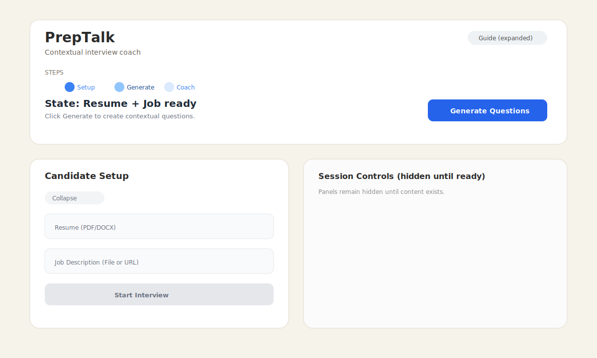
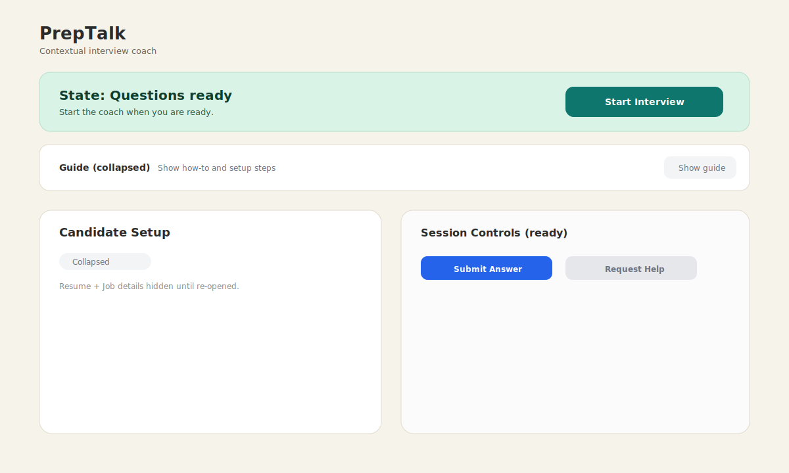
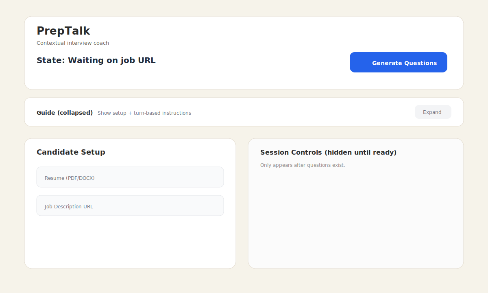
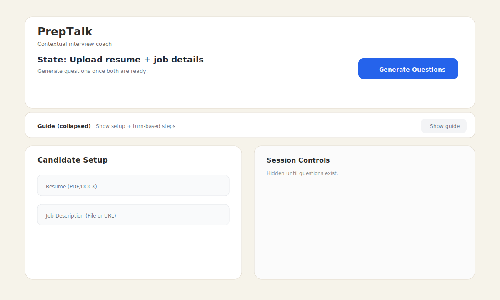

# Feature Spec: 20260205-visual-options

Status: Active
Created: 2026-02-05 09:15
Inputs: CR-20260205-0912, CR-20260205-0910
Decisions: D-20260205-0915

## Summary
Provide three distinct UI/UX visual options that emphasize CTA clarity, larger state-change messaging, and a collapsible PrepTalk hero guide once questions are generated.

## User Stories & Acceptance

### US1: Compare CTA-focused layouts (Priority: P1)
Narrative:
- As a product owner, I want three clear layout options with visuals, so that I can choose a direction that improves CTA clarity and interaction flow.

Acceptance scenarios:
1. Given this spec, When I review the options section, Then I see three labeled options with rationale and a mock image for each. (Verifies: FR-001, FR-002)
2. Given each option, When I read the notes, Then the state-change text emphasis and hero collapse behavior are explicitly described. (Verifies: FR-003)

## Requirements

Functional requirements:
- FR-001: Provide three distinct CTA-focused layout options with short rationale. (Sources: CR-20260205-0912; D-20260205-0915)
- FR-002: Each option includes an embedded mock image stored in `docs/specs/20260205-visual-options/assets/`. (Sources: CR-20260205-0912; D-20260205-0915)
- FR-003: Each option calls out larger state-change messaging and a collapsible hero guide after question generation. (Sources: CR-20260205-0912, CR-20260205-0910; D-20260205-0915)

## Options

### Option 1: Stepper Hero (Guided Progress)
Why it works:
- Uses a visible stepper to show Setup → Generate → Coach progression.
- Keeps a single primary CTA and elevates state-change text near the CTA.
- Collapsing the hero turns the guide into a compact progress badge, reducing noise after questions are ready.

Mock image:

### Option 2: CTA Ribbon (Immediate Action)
Why it works:
- A bold action ribbon makes the next step unmissable without needing to scan the hero.
- The guide collapses into a small “Show guide” toggle, keeping focus on the CTA and state messaging.
- Strong hierarchy for turn-based flows where timing and readiness matter.

Mock image:

### Option 3: Compact Guide Card (Focus Mode)
Why it works:
- Keeps the hero in a smaller card with a prominent state line and CTA.
- Works well with the existing two-container layout while reducing vertical space.
- Collapsible guide stays discoverable but out of the way once questions exist.

Mock image:

### Option 4: Minimal Risk Refresh (Current Layout + Tighten)
Why it works:
- Preserves the current two-container structure to reduce implementation risk.
- Upgrades the state-change text size, button hierarchy, and spacing without reflowing panels.
- Adds a small collapsed guide row below the header so the how-to remains accessible but unobtrusive.

Mock image:

## Edge cases
- If questions are not yet generated, the hero remains expanded; the collapse toggle only appears once questions exist. (Verifies: FR-003)
