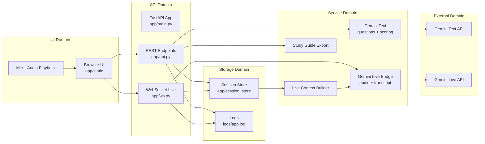

# System Diagram

```mermaid
flowchart LR
  %% Domains
  subgraph UI["UI Domain"]
    Browser["Browser UI\napp/static"]
    Audio["Mic + Audio Playback"]
  end

  subgraph API["API Domain"]
    FastAPI["FastAPI App\napp/main.py"]
    REST["REST Endpoints\napp/api.py"]
    WS["WebSocket Live\napp/ws.py"]
  end

  subgraph Services["Service Domain"]
    TextSvc["Gemini Text\nquestions + scoring"]
    LiveSvc["Gemini Live Bridge\naudio + transcript"]
    Prompt["Live Context Builder"]
    PDF["Study Guide Export"]
  end

  subgraph Storage["Storage Domain"]
    SessionStore["Session Store\napp/session_store"]
    Logs["Logs\nlogs/app.log"]
  end

  subgraph External["External Domain"]
    GeminiText["Gemini Text API"]
    GeminiLive["Gemini Live API"]
  end

  %% Flows
  Browser --> REST
  Browser --> WS
  Audio --> Browser

  REST --> TextSvc
  REST --> PDF
  REST --> SessionStore
  REST --> Logs

  WS --> LiveSvc
  WS --> SessionStore
  WS --> Logs

  TextSvc --> GeminiText
  LiveSvc --> GeminiLive
  Prompt --> LiveSvc
  SessionStore --> Prompt
```
